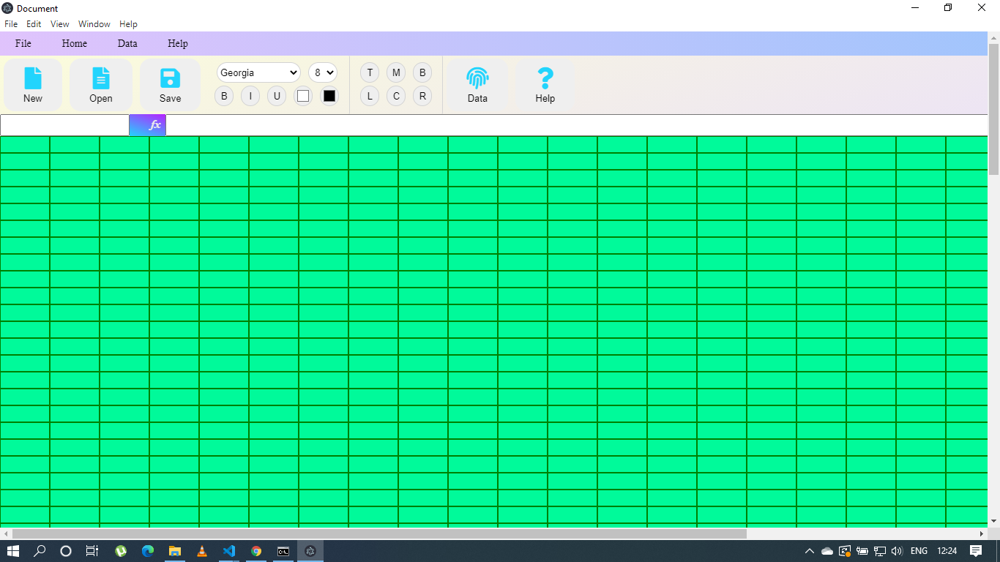

# Excel Clone Using Electron.js

## Discription :small_red_triangle_down: :-
 This is Electron.js project in which design the UI with the help of HTML,CSS with the help of electron.js framework to deploy the desktop application.
 Where the functionalites of the project are similer the excel sheet we calculate the formula and so many stuff in this project.
 
 ## Technologies :rocket::-
Project is created with:
* Node.js :heavy_check_mark:
* JavaScript :heavy_check_mark:
* Jquery :heavy_check_mark:
* DOM :heavy_check_mark:
* Electron.js :heavy_check_mark:
* HTML/CSS :heavy_check_mark:

## Commands Used for This Project :-
```
npm start
```

## UI Image of the project :-


